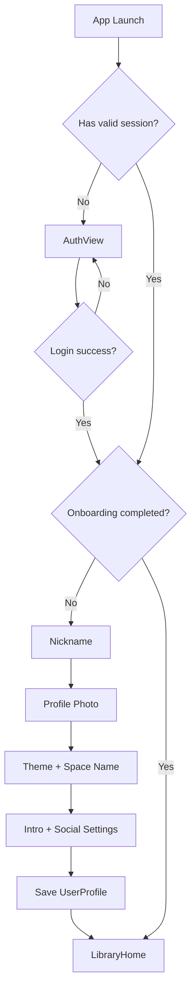
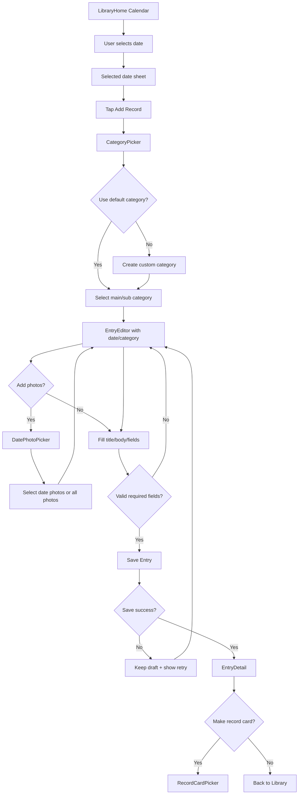
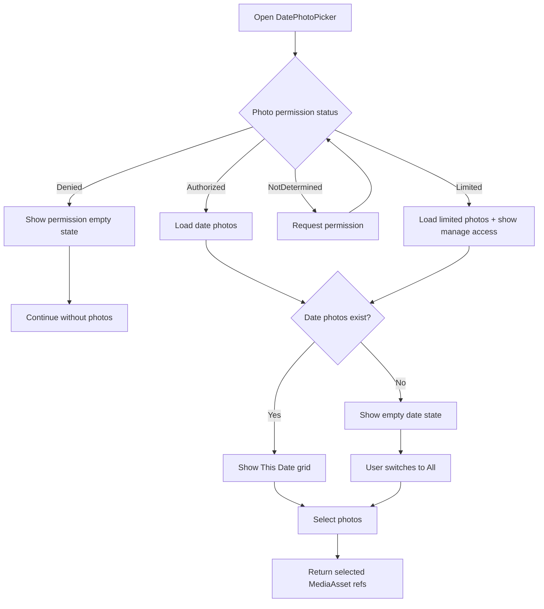
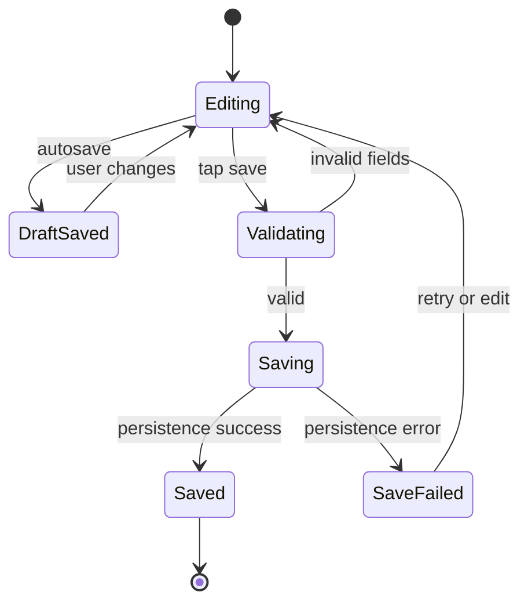
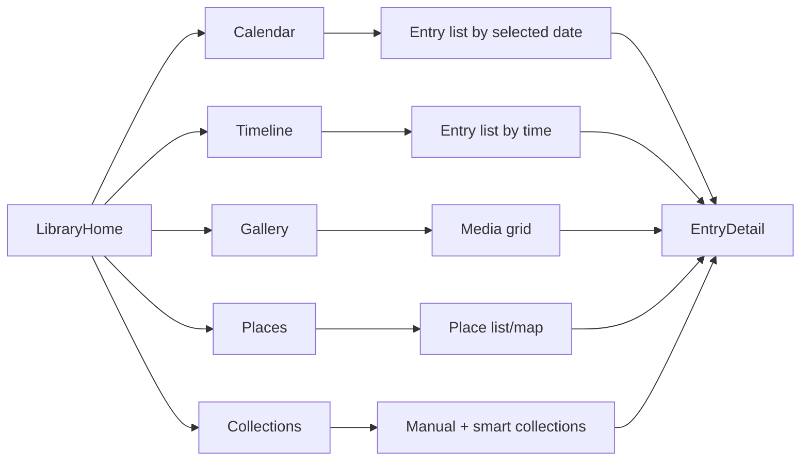
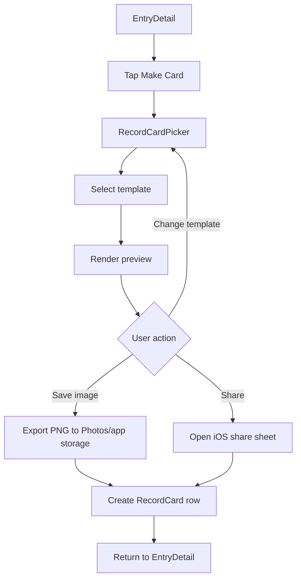
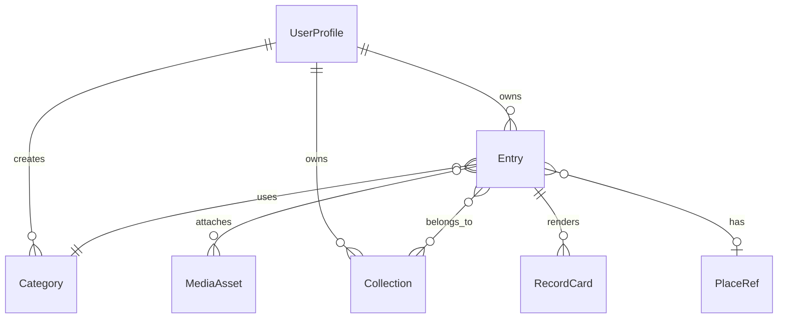

# Write & Record iOS App - Flow Charts

아래 Mermaid는 구현 AI에게 그대로 전달 가능.

## 1. App Launch/Auth/Onboarding

## 2. Create Entry From Calendar

## 3. Photo Permission/Picker

## 4. Entry Save State

## 5. Library View Switch

## 6. Record Card Creation

## 7. Data Relationship

