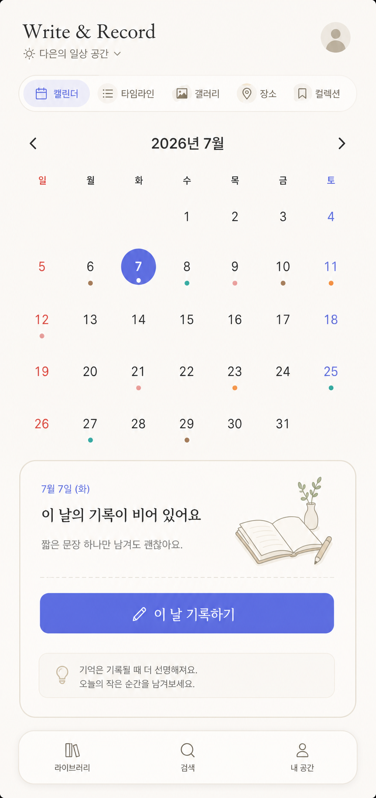

# Write & Record - Visual Direction and UI Concept

목적: 프론트 구현 전에 앱의 얼굴과 사용감을 고정한다. 이 문서는 화면을 바로 개발하기 위한 지시서가 아니라, 이후 SwiftUI 화면을 다듬을 때 기준이 되는 디자인 방향 문서다.

핵심 판단:
- Write & Record는 예쁜 다이어리 앱이기 전에 "매일 믿고 쓰는 기록장"이다.
- 첫 화면은 감성보다 명확성이 우선이다.
- 사용자는 앱을 열자마자 오늘과 기록 여부를 알아야 한다.
- 기록 추가 CTA는 하나의 주 동선으로 모아야 한다.
- 장식은 기록을 더 읽고 싶게 만들 때만 사용한다.

## 1. Product Feeling

목표 감성:
- calm personal archive
- daily blog
- editorial note
- warm utility
- organized memory

한 문장:
- "하루를 고르고, 내 취향과 순간을 조용히 쌓아가는 개인 기록 공간."

피해야 할 인상:
- 기본 SwiftUI 샘플 앱처럼 보이는 화면.
- 금융/업무 대시보드처럼 차가운 화면.
- 소셜 앱처럼 계속 공유를 유도하는 화면.
- 다이어리 앱처럼 장식이 과해 입력을 방해하는 화면.
- 기능이 많아 어디서 시작해야 할지 헷갈리는 화면.

## 2. Current Screen Diagnosis

현재 캘린더 화면의 좋은 점:
- 앱의 중심이 캘린더라는 점이 바로 보인다.
- 기록 없는 날짜의 empty state가 명확하다.
- 하단 탭 구조가 핵심 영역을 크게 벗어나지 않는다.
- 전체 톤이 과하게 화려하지 않다.

현재 화면에서 다듬을 점:
- 상단 `+`, 선택 날짜 영역의 `+ 기록 추가`, 하단 탭의 `기록`이 동시에 보여 CTA가 분산된다.
- 하단 탭바가 크고 떠 있어서 기록 앱보다 런처/유틸리티 느낌이 난다.
- 캘린더 월 영역과 empty state가 기능적으로만 이어져 감정적 연결이 약하다.
- 선택된 날짜의 의미가 "오늘 내가 남길 수 있는 이야기"로 충분히 느껴지지 않는다.
- 색상과 버튼이 아직 앱 고유의 취향보다는 시스템 기본값에 가깝다.

디자인 개선 방향:
- 기록 추가는 선택 날짜 문맥에서 가장 강하게 보여준다.
- 상단 `+`는 제거하거나 secondary action으로 낮춘다.
- 하단 탭바는 더 가볍고 iOS native tab에 가까운 밀도로 낮춘다.
- empty state는 "없음"보다 "오늘의 첫 기록"을 부드럽게 유도한다.
- 기록 있는 날짜는 작은 dot만이 아니라 category color memory로 느껴지게 한다.

## 3. Navigation and CTA Principles

Primary loop:

```text
앱 열기
-> 오늘 또는 원하는 날짜 보기
-> 그날 기록 확인
-> 기록 추가
-> 저장
-> 다시 캘린더에서 기록 흔적 확인
```

CTA 원칙:
- 한 화면에 primary CTA는 하나만 둔다.
- 캘린더에서는 선택 날짜 하단의 "기록 추가"가 primary CTA다.
- 하단 탭의 "기록"은 빠른 생성 탭이 아니라, 필요하면 중앙 quick action으로만 사용한다.
- 상단 `+`는 캘린더 화면에서는 제거하는 편이 좋다.
- empty state CTA 문구는 "첫 기록 남기기" 또는 "오늘 기록하기"를 사용한다.

권장 CTA 구조:
- Calendar selected-date section:
  - primary: "이 날 기록하기"
  - secondary: 기록이 있으면 "기록 더하기"
- Bottom tab:
  - Library
  - Search
  - My Space
  - 중앙 floating create는 P1 이후 검토

## 4. Visual System Direction

### Color

기본 배경:
- `#FBFAF7` warm paper

표면:
- `#FFFFFF` clean card
- `#F3F0EA` soft control

텍스트:
- `#1F1F1F` primary
- `#73706A` muted

주 색상:
- 기존 `#5B6CFF`는 유지 가능하지만 조금 덜 전자적인 톤이 좋다.
- 권장 primary: `#6267F1`
- selected date fill: primary
- CTA text: primary

보조 감성 색:
- daily rose: `#F4A7B9`
- food apricot: `#F2A65A`
- place teal: `#50B9B0`
- book brown: `#B68B5E`

색상 원칙:
- 배경은 따뜻하게, 액션은 또렷하게.
- category color는 큰 면적보다 점, 라벨, 얇은 라인에 사용한다.
- purple/blue 한 가지 색으로 전체를 덮지 않는다.

### Typography

기본:
- iOS system font.

화면 제목:
- 크고 무겁게보다, 날짜/공간 이름이 읽히는 정도로.

캘린더 숫자:
- 숫자가 앱의 리듬이므로 여백과 크기를 충분히 준다.
- 선택 날짜는 bold보다 fill + contrast로 표현한다.

본문/기록 카드:
- 긴 기록을 읽어야 하므로 Body 16 이상.
- 메타 정보는 13~15 사이.

### Shape and Spacing

radius:
- controls: 10~14
- repeated entry cards: 8~12
- full-width panels: card처럼 띄우지 말고 구분선/배경으로 처리

spacing:
- 화면 좌우 padding 20
- 캘린더 grid는 날짜 간 간격을 일정하게 유지
- empty state는 너무 아래로 밀지 않고 선택 날짜 영역과 연결

shadow:
- 강한 그림자 금지.
- tab bar나 floating element에만 아주 약하게 사용.

## 5. Calendar Home Concept

목표:
- 사용자가 "오늘 뭐 쓰지?"보다 "오늘 여기 남기면 되겠다"라고 느껴야 한다.

권장 정보 구조:

```text
Top
- small greeting or space name
- current month context

View switch
- Calendar / Timeline / Gallery / Places / Collections

Calendar
- month navigation
- weekday row
- date grid
- selected date fill
- entry dots or tiny category marks

Selected date panel
- date title
- record count or empty message
- primary CTA
- entry list when exists
```

Current empty state 개선:
- 현재: "아직 기록이 없어요"
- 권장:
  - title: "이 날의 기록이 비어 있어요"
  - body: "짧은 문장 하나만 남겨도 괜찮아요."
  - CTA: "이 날 기록하기"

기록이 있는 상태:
- 날짜 패널에는 entry card를 1~3개 보여준다.
- card는 제목, 카테고리, 짧은 body preview, photo thumbnail optional.
- "더 보기"는 기록이 많을 때만 노출한다.

## 6. Bottom Navigation Concept

현재 하단 탭바:
- 시각적으로 큼.
- 흰 pill이 강해서 화면의 주인공처럼 보인다.
- 중앙 `기록`이 주 CTA처럼 보이나, 캘린더의 날짜 선택 CTA와 충돌한다.

권장:
- native tab bar에 가까운 가벼운 구조.
- Library / Search / My Space 중심.
- Create는 캘린더 선택 날짜 CTA로 우선 처리.
- 빠른 기록이 필요해지면 P1에서 중앙 floating create를 검토한다.

금지:
- 상단, selected-date, bottom tab에 모두 `+`를 두지 않는다.
- 탭바가 캘린더보다 더 눈에 띄면 안 된다.

## 7. Entry Editor Concept

목표:
- 글을 길게 쓰는 사람과 제목만 빠르게 남기는 사람 모두 편해야 한다.

권장 구조:
- 상단: cancel / date + category / save
- 제목 입력
- body 입력
- 사진 추가
- rating/wishlist
- 추가 정보는 접힌 section

중요:
- 저장 버튼은 항상 닿는 위치에 있어야 한다.
- 필수값은 title/date/category 정도로 낮게 유지한다.
- 사진 권한이 없어도 editor가 무너지지 않는다.
- placeholder는 설명보다 예시가 좋다.

문구 예:
- 제목 placeholder: "오늘 기억하고 싶은 것"
- body placeholder: "짧게 적어도 괜찮아요."
- save toast: "기록했어요"

## 8. Entry Detail Concept

목표:
- 저장 후 "잘 남겼다"는 감각을 줘야 한다.
- 다시 읽을 때 블로그 글처럼 편해야 한다.

권장 구조:
- date + category
- title
- body
- photos
- metadata sections
- edit/share/card actions

톤:
- 상세 화면은 editor보다 더 editorial하게.
- 본문 읽기 여백을 충분히 준다.
- 기록 카드 만들기는 P2이므로 과하게 전면에 두지 않는다.

## 9. Onboarding Concept

목표:
- 앱 사용 전 과한 설명 없이 내 공간을 만든다는 느낌을 준다.

권장:
- 한 화면 한 결정.
- 닉네임.
- 공간 이름.
- 테마.
- 알림/공유 설정은 나중에 해도 되는 선택.

문구 톤:
- "기록을 시작하기 전에, 내 공간을 가볍게 만들어볼게요."
- "사진은 나중에 넣어도 괜찮아요."
- "공유 기능은 언제든 끌 수 있어요."

## 10. Visual Mockup Brief

Generated concept image:



주의:
- 이 이미지는 최종 UI 시안이 아니라 방향성 참고 이미지다.
- SwiftUI 구현 시 정확한 spacing, Dynamic Type, accessibility, safe area는 실제 코드에서 다시 검증한다.
- 이미지 안의 문구보다 이 문서의 문구와 UX 원칙을 우선한다.

이미지를 만들 때 기준:
- iPhone portrait app mockup.
- clean SwiftUI-like interface.
- warm paper background.
- calendar-first daily record app.
- Korean UI text.
- selected date panel with soft empty state.
- restrained bottom navigation.
- no marketing hero.
- no decorative blobs.
- no dark mode.

Mockup must show:
- month calendar.
- selected date.
- one clear primary CTA.
- record-empty panel or small record preview.
- calm personal archive tone.

Avoid:
- purple gradient background.
- glassmorphism overuse.
- huge floating cards.
- app-store marketing copy.
- too many plus buttons.
- crowded dashboard widgets.

## 11. Implementation Guardrails

프론트 개발 전 결정:
- Calendar home is the first screen.
- One primary CTA per screen.
- Entry persistence and draft safety are more important than visual polish.
- UI should be warm, but every screen must still feel like a tool.
- Empty states should invite recording, not explain the app.

프론트 개발 때 확인:
- iPhone SE에서 탭바/CTA가 겹치지 않는가.
- 선택 날짜 패널이 첫 화면에서 보이는가.
- 긴 카테고리명과 긴 제목이 깨지지 않는가.
- Dynamic Type에서 주요 CTA가 잘리지 않는가.
- 색만으로 카테고리를 구분하지 않는가.

## 12. Final Direction

Write & Record의 화면은 "꾸민 다이어리"보다 "조용히 쌓이는 개인 블로그"에 가깝다.

가장 좋은 첫 버전은 화려한 앱이 아니라, 사용자가 일주일 동안 실제로 열고 기록할 수 있는 앱이다.
